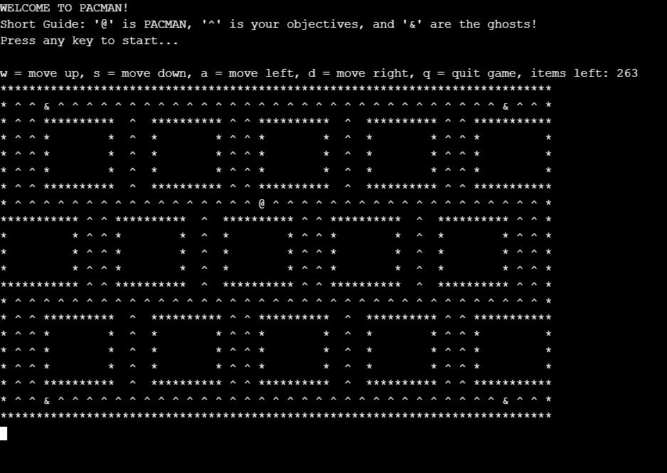

# Pacman In C

Modern deployment of the arcade game Pacman with an arduino controller, built with C and Arduino IDE

## Final Product

## Getting Started

To get started, you simply need to clone the repo and run the file SE_Whole_Pacman.c on any compiler of your choice, or using an [online compiler](https://www.onlinegdb.com/online_c_compiler).
